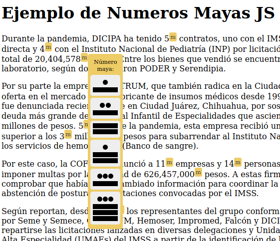
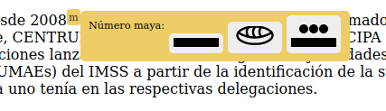

**Numeros Mayas JS - Agregue números mayas a su sitio web**
===========================================================

## Introducción

Esta librería agrega números mayas como alternativa a cualquier número arábigo que se detecte en las páginas en las que esté incluída. Es configurable el estilo del botón, del desplegable y el selector de elementos para realizar el reemplazo. Sólo trabaja con números enteros, todos los decimales se redondean al entero más cercano.

Este proyecto nace a partir la investigación periodística, de datos y corporativa sobre los impactos del proyecto Tren Maya en el sureste mexicano realizada por PODER.

Usar [GENERADOR](https://projectpoder.github.io/numeros-mayas-js/).

Ver [EJEMPLO](https://projectpoder.github.io/numeros-mayas-js/demo.html).

Ejemplo de la librería en vertical:



Ejemplo de la librería en horizontal:



### ¿Qué son los números mayas?

La matemática maya es una antigua técnica que aún se practica, se investiga y se enseña en diferentes zonas de centroamérica y el sur de México. Tiene grandes ventajas sobre la matemática corriente: por estar en base 20, con pocos números se puede llegar a expresar valores grandes, además es más simple en su expresión porque tiene sólo 3 símbolos: punto (1), raya (5) y cero. Esta matemática incluyó el concepto del cero antes que en la India, este se representa de diferentes formas, siendo el caracol la más común. Además para hacer operaciones matemáticas (suma, resta, multiplicación , etc) resulta muy sencillo realizarlas de forma analítica sin necesidad de aprender tablas o técnicas complejas propensas a errores.

Es importante difundir y promover el uso de esta notación para destacar lo rico de la cultura Maya y ampliar la perspectiva sobre lo que es posible hacer en matemática y en la web. Para más detalles revisa las fuentes bibliográficas consultadas para este trabajo.

## Instrucciones de uso

Para un ejemplo, revise el archivo `demo.html`.

1.  (opcional) Descargar el archivo numeros-mayas.js y copiarlo a la carpeta de javascript de su sitio
2.  Incluya este código en su sitio antes del fin del body
```
<script type="text/javascript" src="https://projectpoder.github.io/numeros-mayas-js/numeros-mayas.js"></script>
<script type="text/javascirpt">
const numeros_mayas_config = {
 button_code: "<span>m</span>",
 direction: "vertical", //or horizontal
 selector: "p"
}
</script>
```
3.  Modifique las opciones de configuración
4.  Actualice su sitio y revise si hay errores en la consola
5.  Si encuentra errores, por favor repórtelos en [*https://github.com/projectpoder/numeros-mayas-js*](https://github.com/projectpoder/numeros-mayas-js)

### Opciones de configuración

Los siguientes valores se pueden configurar dentro de la variable global `numeros_mayas_config`.

**button_code**: Es el código HTML que se utilizará para mostrar el botón de desplegar el número maya. Default:  `<span style="vertical-align: super; font-size: 0.7em; color: #333; background: #ec6;padding: 2px; border-radius: 3px; cursor: pointer" title="Ver este número en idioma maya">m</span> `.

**direction**: Es la dirección en la que se desplegará el número maya, puede ser horizontal o vertical. Default: `vertical`.

**selector**: Es el selector CSS para los elementos en los que se buscarán números arábigos para reemplazar. Se puede utilizar una etiqueta, id, o clase. Default: `p`.

**number_container_style**: Es el código CSS para el contenedor de los números mayas. Se puede personalizar el color. Para el tamaño utilizar zoom. Default: `display: none; position: absolute; padding: 5px; border-radius: 5px; background: #ec6; text-align: center;`.

#### Contenido dinámico
Si desea aplicar números maya a contenido dinámico, puede llamar a la función `marcarNumerosArabigos({selector: "[selector]"});` indicando un selector específico para el nuevo contenido.

Nota: Actualmente, ejecutar la función dos veces sobre el mismo objeto causa problemas.

## Contribuciones

Este proyecto está abierto a colaboración, algunas ideas de tareas pendientes:
- [ ] Publicar el paquete en NPM
- [ ] Traducir documentación
- [ ] Modo "inline" para el reemplazo de números
- [x] Activar para números cargados dinámicamente
- [ ] Nuevas funcionalidades que se hagan necesarias para usos específicos

Para consultas contactar a msz@poderlatam.org

## Créditos

Esta librería creada por Martín Szyszlican [*msz@poderlatam.org*](mailto:msz@poderlatam.org) implementa una versión de la matemática vigesimal maya tradicional. El código está basado en el trabajo de Carlos Bustillo “Aprender numeración maya” [*https://github.com/cabustillo13/Aprender-numeracion-maya/*](https://github.com/cabustillo13/Aprender-numeracion-maya/)

El gráfico para el cero está adaptado a partir del archivo disponible en Wikipedia [*https://es.wikipedia.org/wiki/Archivo:Mayan00.svg*](https://es.wikipedia.org/wiki/Archivo:Mayan00.svg)

### Agradecimientos:

-   Club de Software Libre
-   PODER
-   Fidencio Briceño
-   Fernando Magaña

### Fuentes bibliográficas consultadas

-   “Numeración Maya” en PueblosOriginarios.com [*https://pueblosoriginarios.com/meso/maya/maya/numeracion.html*](https://pueblosoriginarios.com/meso/maya/maya/numeracion.html)
-   “El sistema de numeración maya“ [*https://prometeo.matem.unam.mx/repositorio/node/1008*](https://prometeo.matem.unam.mx/repositorio/node/1008)
-   “Las matemáticas y los mayas”, Luis Fernando Magaña, Ciencias 19, Julio 1990 [*http://vinculacion.dgire.unam.mx/vinculacion-1/sitio\_LCDC/PDF-LCDC/REVISTA-DE-CIENCIAS-MATEMATICAS/Doc24.pdf*](http://vinculacion.dgire.unam.mx/vinculacion-1/sitio_LCDC/PDF-LCDC/REVISTA-DE-CIENCIAS-MATEMATICAS/Doc24.pdf)
-   “Los números mayas y el calendario maya“, Mark Pitts [*http://www.famsi.org/spanish/research/pitts/GlifosMayasLibro2.pdf*](http://www.famsi.org/spanish/research/pitts/GlifosMayasLibro2.pdf)
-   Diccionario Maya Cordemex. Maya-Español, Español-Maya. [Vásquez A.B.](https://b-ok.lat/g/V%C3%A1squez%20A.B.) Merida: Ediciones Cordemex, 1980. <https://b-ok.lat/book/3261710/527437?regionChanged=&redirect=33201554>
